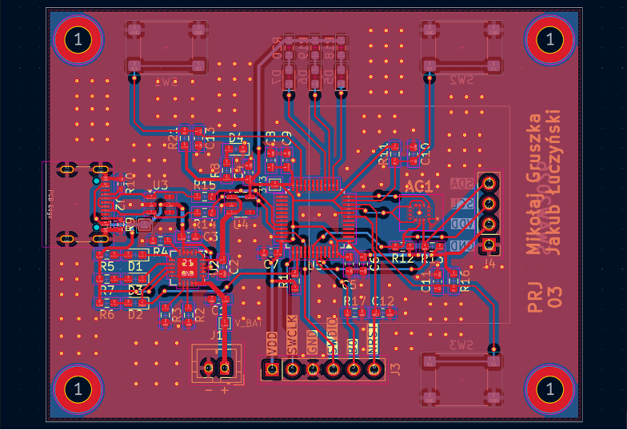
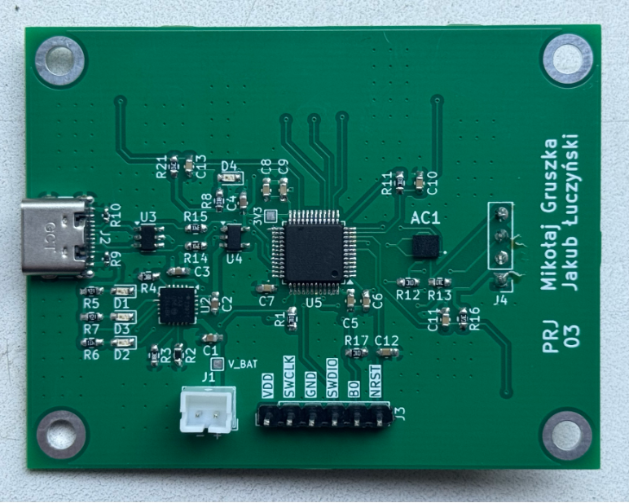

# Digital Spirit Level 

A compact, battery-powered digital level built with an STM32 microcontroller and an OLED screen. This project was developed as part of the "Sensors in Embedded Applications" course at AGH University of Science and Technology.

## Project Overview
The goal was to design a highly portable, precise digital measuring tool. The device features a USB-C port for charging, built-in Li-Ion battery support, and a three-button interface for resetting or zeroing the position. 

## Hardware & Components
The component selection prioritizes low power consumption, accuracy, and a small physical footprint.

* **Microcontroller:** STM32L433 (ARM Cortex-M4) - Picked for its low power usage and built-in FPU (Floating Point Unit) for faster angle calculations. It also runs without an external crystal oscillator, saving board space.
* **IMU Sensor:** LSM6DSO - A 6-axis accelerometer/gyroscope chosen for its high stability and low noise. Communicates over I2C.
* **Power Management:** MCP73871 - A load-sharing charge controller. It allows the device to be used normally while the Li-Ion battery is charging.
* **Display:** 0.96-inch OLED - A small, high-contrast I2C screen for the user interface.
* **Connectivity:** USB-C (charging) and SWD (programming).

